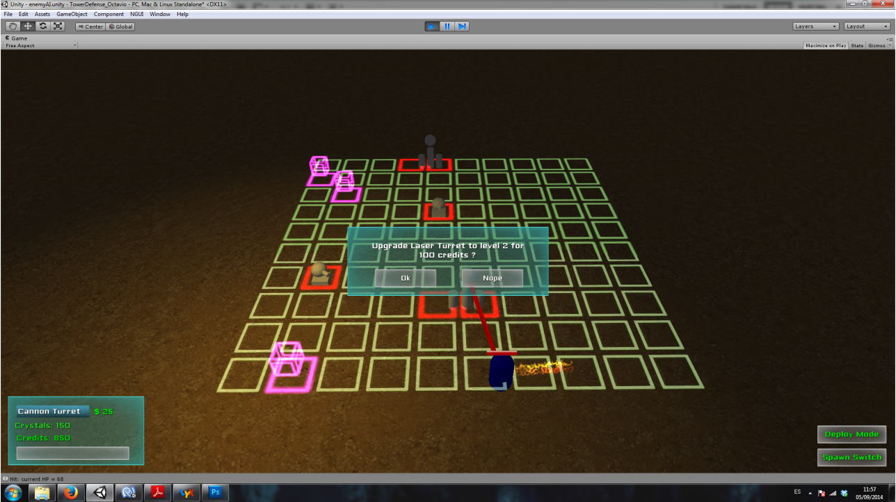

# tower-defense-demo
 tower defense game prototype - basic functionality - Unity, C#

Overview
------------

The game goal is to defend a series of crystals agains constantly spawning enemies,
that try to steal them from the player. To achieve that, the player can deploy
several types of turrets that will automatically attack the enemies in their range.
The player may upgrade the turrets to increase their fire damage or deploy new
ones in the game scenario, as long as he has enough money to afford either the
upgrade or the new turret. Money is gained by defeating enemies so as to fortify
the defenses and prevent the enemies from stealing the player crystals.

Screens
--------

Author
-------
Octavio Martinez
